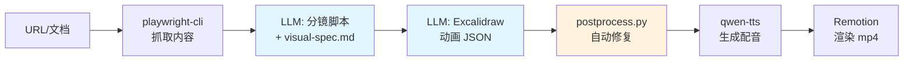

# Seedance 生成视频改不了？试试这个可编辑方案：Excalidraw + Remotion + TTS

> 项目地址：[remotion-excalidraw-video](https://github.com/heimanba/remotion-excalidraw-video)

## 背景

### 视频制作的三难

想要一个 5 分钟的产品介绍视频，传统方式有三条路：

1.  **找外包**：花几万块，等 1-2 周，改稿要额外收费
    
2.  **自己做**：啃 AE/PR 几周，做出来还不一定好看
    
3.  **AI 生成**：像 [Seedance 2.0](https://seed.bytedance.com/zh/seedance2_0)，[通义万相](https://help.aliyun.com/zh/model-studio/image-to-video-api-reference/) 这样的视频生成工具很强大，但...
    

### AI 生成视频的三个问题

端到端的 AI 视频生成模型（如 Seedance 2.0、通义万相、Sora）虚实质量很高，但对于技术内容制作者来说，有三个绕不开的问题：

**问题 1：黑盒输出，改不了**

```plaintext
Prompt: "生成一个产品介绍视频..."
↓
输出：视频文件 video.mp4

```

*   配色不喜欢？重新生成
    
*   文案有错误？重新生成
    
*   某个镜头不满意？还是重新生成
    

每次重生成都是完整的 GPU 推理成本，而且可能把原本满意的部分也改掉了。

**问题 2：技术术语难精确**

```plaintext
Prompt: "展示 npm install @qwen-code/cli 的执行过程"
↓
视频中可能：
- 命令显示错误
- TTS 读成 "at queen code slash cli"
- 代码结构无法精确控制

```

**问题 3：批量生产难保证一致性** 制作 50 集技术教程系列时：

*   每集的视觉风格可能不同
    
*   统一修改配色方案？全部重跑
    
*   统一调整字体大小？没有入口
    

### 本项目的解法

**用 LLM 生成可编辑的中间产物，而不是直接生成视频。**

```plaintext
URL/文档
↓
LLM 生成
↓
│
├─ 分镜脚本.md        ← 可编辑文本
├─ visual-spec.md     ← 可编辑规范
├─ 动画.excalidraw     ← 可编辑 JSON
├─ 配音.mp3           ← 可替换文件
↓
Remotion 渲染 ← 确定性流程
↓
video.mp4

```

**核心优势：每一个环节都是可控的。**

*   配色不喜欢？改 `visual-spec.md` 重跑配图，分镜脚本复用
    
*   文案有错误？改 `narration` 字段，重新 TTS，动画复用
    
*   某个镜头不满意？只重生成那一个 `.excalidraw` 文件
    

最近在社区里也有开发者用 Remotion + Excalidraw + TTS 做出了完整的视频示例：


虚实质量和专业视频有差距，但对技术内容已经够用。最关键的是——**无论是 Excalidraw（本质是 JSON）还是 TTS，每一个环节都是可控的。**

## 效果

下面是用本项目生成的一个示例：6 个分镜、约 3 分钟的产品介绍视频，从输入 URL 到导出 mp4 全程约 16 分钟。


## 核心概念

本项目依赖 [qwen-code](https://qwenlm.github.io/qwen-code-docs/) 的 **SKILL 能力**。SKILL 本质上是一套结构化的 Prompt + 约束规范 + 参考示例，指导 AI 按照特定流程完成复杂任务，类似于给 AI 一份"标准作业手册"。

整个流程由两个 SKILL 协作完成：

| SKILL | 职责 | 核心输出 |
| --- | --- | --- |
| `product-storyboard` | 剧本编写 + 分镜拆分 | 分镜脚本 `scenes/NN.md` + 全局视觉规范 `visual-spec.md` |
| `excalidraw-diagram` | 单个分镜的动画制作 | `assets/NN.excalidraw`（遵守 `visual-spec.md` 的配色和风格） |

两者通过 `visual-spec.md` 这个"契约文件"保证风格一致性——storyboard 负责"说什么"，diagram 负责"画什么"。


## 快速开始

### 安装

```shell
git clone https://github.com/heimanba/remotion-excalidraw-video
cd remotion-excalidraw-video && npm install
cp .env.example .env  # 填入百炼 API Key

```

### 使用步骤

1.  **生成分镜脚本**：在 qwen-code 中输入 `"创建分镜 https://qwenlm.github.io/qwen-code-docs/en/users/overview/"`，触发 `product-storyboard` 技能，自动在 `public/storyboard/` 目录生成分镜大纲、视觉规范和逐场脚本
    
2.  **为分镜配图**：在 qwen-code 中输入 `"为分镜 01 生成 Excalidraw 配图"`，触发 `excalidraw-diagram` 技能，为每个分镜单独生成 Excalidraw 动画 JSON。生成后可使用 [excalidraw-animate](https://dai-shi.github.io/excalidraw-animate/) 预览效果，不满意可直接问 qwen-code 微调
    
3.  **生成字幕与配音**：执行 `npm run generate`，自动从分镜脚本提取字幕并调用 qwen-tts 生成配音
    
4.  **预览与导出**：`npm run dev` 预览效果，满意后导出 mp4 视频
    

### 时间与成本参考（6 分镜视频）

> 以下数据基于 MacBook Pro M2、正常网络环境、使用 qwen-max 模型测试。

| 步骤 | 耗时 | 备注 |
| --- | --- | --- |
| 生成分镜脚本 | ~2 分钟 | 含 URL 抓取和 LLM 生成 |
| 生成全部配图 | ~10 分钟 | 每个分镜约 1-2 分钟 |
| TTS 配音 | ~1 分钟 | 调用百炼 API |
| Remotion 渲染 | ~3 分钟 | 取决于视频时长 |
| **总计** | **~16 分钟** | 首次可能需要调整重试 |

## 架构

整体思路和漫剧制作一致：**剧本 → 分镜 → 动画 → 配音 → 渲染**




核心依赖：

*   动画引擎：[excalidraw-animate](https://github.com/dai-shi/excalidraw-animate)
    
*   语音合成：[qwen-tts](https://help.aliyun.com/zh/model-studio/qwen-tts-api)
    
*   视频渲染：[Remotion](https://www.remotion.dev/)
    

## 关键问题与解法

### 为什么需要拆分两个 SKILL

核心原因是 **token 限制**。每个分镜的 Excalidraw JSON 接近 1000 行，如果在一个 SKILL 中完成所有任务，token 很快超限。

拆分后的额外好处：

*   **关注点分离**：各自的 Prompt 更聚焦，生成质量更稳定
    
*   **独立重试**：某个分镜不满意，只需重跑 `excalidraw-diagram`，不影响其他分镜
    
*   **并行执行**：多个分镜的配图理论上可以并行生成
    

### 如何保证多个分镜的视觉一致性

通过两层机制解决风格漂移问题：

**第一层：生成时约束（visual-spec.md）**

`product-storyboard` 在分析内容时确定全局视觉规范，写入 `visual-spec.md`。`excalidraw-diagram` 生成每个分镜时必须先读取这个文件，将规范映射为 Excalidraw 的具体属性。

```yaml
---
canvas_size: 1920x1080
style_tone: 简洁专业
color_palette:
  primary: "#4A90D9"
  secondary: "#7EC8E3"
  accent: "#FF6B6B"
  title: "#1a1a1a"
  text: "#333333"
font_sizes:
  title: 32
  subtitle: 24
  body: 18
  caption: 14
---

```

**第二层：生成后修复（postprocess.py）**

这是工程化思路的核心体现：**承认 LLM 输出的不确定性，用确定性的自动化流程来兜底。**

即使有规范约束，LLM 输出仍然会有偏差（颜色偏离、roughness 混用、尺寸异常等）。`postprocess.py` 在每个 `.excalidraw` 文件保存后**自动触发**，通过规则引擎强制校正所有不一致的样式。

工程化优势：

*   **确定性**：规则驱动的修复，结果可预测、可复现
    
*   **自动化**：无需人工介入，文件保存即修复
    
*   **可维护**：修复规则集中管理，新增问题只需补充规则
    
*   **容错性**：允许 LLM 输出不完美，后处理保证最终质量
    

思路是：**不期望 LLM 输出完美的 JSON，而是用确定性的后处理来兜底。**

常见修复规则（共十余种）：

| 问题类型 | 修复方式 |
| --- | --- |
| `width/height` ≤ 0 | 按元素类型设置最小值 |
| 绑定不一致 | 双向同步 `boundElements` ↔ `containerId` |
| `fontFamily` 错误 | 强制设为 5（支持中文） |
| 文本宽高不匹配 | 根据内容区分中英文重新估算 |
| 字号过小 | 按目标分辨率（1920×1080）计算最小可读字号 |

### 时间轴的一致性

视频中有三条时间线需要对齐：动画播放、字幕显示、TTS 配音。

核心原则：

*   **字幕和 TTS 严格一致**：字幕文本直接从分镜的 `narration` 字段提取，TTS 也用同一份文本生成
    
*   **场景时长取最大值**：每个场景的帧数 = `max(动画时长, TTS 配音时长)`，确保"声音说完了画面才切"
    
*   **场景之间不能"串"**：不能出现上一场的字幕还在、画面已切到下一场的情况
    

### TTS 友好的文案

命令行、URL 等内容直接送给 TTS 会很奇怪，比如 `"执行安装: npm install -g @qwen-code/qwen-code@latest"`。

解法是在 `product-storyboard` 生成解说词时，通过 [Narration 文案规范](https://github.com/heimanba/remotion-excalidraw-video/blob/master/.qwen/skills/product-storyboard/references/storyboard-schema.md#narration-%E6%96%87%E6%A1%88%E8%A7%84%E8%8C%83tts%E5%AD%97%E5%B9%95%E5%8F%8B%E5%A5%BD) 约束 LLM 输出：

*   每句不超过 25 字，便于 TTS 断句
    
*   口语化表达，避免书面语
    
*   技术术语保留英文原文（如 React、API），不翻译
    
*   命令行、URL 等改为口语化描述
    

## 优势：全链路可控

**动画可控**：Excalidraw JSON 可精确编辑，局部不满意直接让 AI 改具体元素，整体不满意重新生成，改完后用 [excalidraw-animate](https://dai-shi.github.io/excalidraw-animate/) 即时预览。

**文案可控**：修改分镜脚本中的 `narration` 字段，重新运行 `npm run generate` 即可同步更新字幕和配音，不需要重新录制。

**节奏可控**：每个场景的时长由动画和配音中较长的一方决定，场景之间有 15 帧淡入淡出转场，最后一个场景额外停留 2 秒，全部自动处理。

**风格可控**：修改 `visual-spec.md` 中的配色方案，重新生成配图即可整体换肤，postprocess.py 确保最终输出与规范一致。

## 局限性

**动画表现力有限**：Excalidraw 动画只支持元素依次出现（fade in），不支持路径动画、变形、移动等复杂效果。适合"讲解型"视频，不适合需要精细动效的品牌宣传片。

**LLM 生成的不确定性**：首次生成的配图成功率约 70-80%，复杂布局容易出现元素重叠或位置偏移，可能需要重新生成或手动微调。

**TTS 的局限**：技术术语密集时断句和语调可能不自然，目前只支持中文，多语言需要切换 TTS 服务。

_适用场景_\*：产品介绍、技术教程、概念讲解、内部培训。不适合需要真人出镜、实拍素材、精细动效的场景。

## 对比：端到端视频生成 vs 可编辑工作流

像 [Seedance 2.0](https://seed.bytedance.com/zh/seedance2_0)、[通义万相-图生视频](https://help.aliyun.com/zh/model-studio/image-to-video-api-reference/) 这样的多模态视频生成模型能力很强，但**与本项目不是替代关系，而是互补关系**。

### 核心差异

| 维度 | Seedance 2.0 等端到端模型 | 本项目方案 |
| --- | --- | --- |
| **生成方式** | 黑盒生成：输入 prompt/图片 → 输出视频文件 | 白盒生成：每个环节都有可编辑的中间产物 |
| **修改成本** | 不满意需重新生成（消耗 token/GPU） | 修改 JSON/文本即可，秒级响应 |
| **视觉风格** | 真实感强、电影级质感 | 简洁图解风格，适合技术内容 |
| **技术术语** | 可能识别不准或读音错误 | 文本驱动，完全精确控制 |
| **成本结构** | 高（需大量 GPU 推理） | 低（主要是 LLM token + Remotion 本地渲染） |
| **迭代效率** | 每次修改需完整重跑 | 只改变化部分，其他复用 |
| **一致性保证** | 依赖模型能力 | 规则引擎 + postprocess 强制保证 |

### 适用场景对比

**选择端到端 AI 视频模型的场景：**

*   **品牌宣传片、产品广告**：需要真实感和视觉冲击力
    
*   **故事性内容、剧情短片**：需要复杂运镜和表演
    
*   **预算充足的项目**：对视觉质量要求极高
    
*   **一次性内容**：后续不需要频繁修改
    

> 推荐选择：

**选择本项目方案的场景：**

*   **产品介绍视频**：需要精确展示功能流程和技术细节
    
*   **技术教程系列**：需要统一风格、批量生成、频繁迭代
    
*   **内部培训材料**：成本敏感、内容为主、视觉为辅
    
*   **多语言版本**：只需替换 TTS 和字幕，视觉部分完全复用
    
*   **需要精确控制**：指定配色、字体、布局、时长等
    

### 工程化的价值

本项目的核心价值不在于"生成质量"，而在于\*\*"可编辑性 + 工程化保障"\*\*：

```python
# 这是 LLM 应用工程化的范本
if llm_output.color not in visual_spec.color_palette:
    # 不期望 LLM 完美，而是用确定性规则兜底
    llm_output.color = find_closest_color(visual_spec.color_palette)

```

当你需要制作 50 集技术教程，每集可能要改 3-5 次文案或配色时，这种可编辑性的价值就远超"一键生成"了。

### 结合使用的可能

两者可以**组合发挥**：

1.  **初版验证**：用本项目快速生成分镜脚本和配图（16 分钟）
    
2.  **确认方向**：预览效果，调整文案和布局
    
3.  **精修升级**：用 Seedance/通义万相为关键场景生成高质量视觉素材
    
4.  **批量生产**：系列内容用本项目保持一致性和可维护性
    

> **阿里云生态组合示例**： 本项目已集成 qwen-max（分镜生成）+ qwen-tts（配音），未来可考虑接入万相-图生视频，实现“结构化内容用 Excalidraw + 关键视觉用万相”的混合方案。

就像 Figma 没有因为 AI 生成 UI 而消失——**设计师需要的不是黑盒生成，而是可精确控制的工具链**。本项目提供的正是视频制作领域的这个价值。

## 相关资料

**核心依赖**

*   [Remotion](https://www.remotion.dev/)：用 React 编写、渲染视频的框架
    
*   [excalidraw-animate](https://github.com/dai-shi/excalidraw-animate)：将 Excalidraw JSON 渲染为逐步动画的工具
    
*   [qwen-tts](https://help.aliyun.com/zh/model-studio/qwen-tts-api)：阿里云百炼平台的语音合成 API
    
*   [qwen-code](https://qwenlm.github.io/qwen-code-docs/)：通义千问的 AI 编程助手，本项目 SKILL 能力的运行环境
    

**相关项目**

*   [remotion-excalidraw-video](https://github.com/heimanba/remotion-excalidraw-video)：本项目源码
    
*   [smart-excalidraw-next](https://github.com/liujuntao123/smart-excalidraw-next)：基于 AI 的智能 Excalidraw 图表生成工具
    
*   [axton-obsidian-visual-skills](https://github.com/axtonliu/axton-obsidian-visual-skills)：Obsidian 可视化技能插件，结合 AI 生成图表
