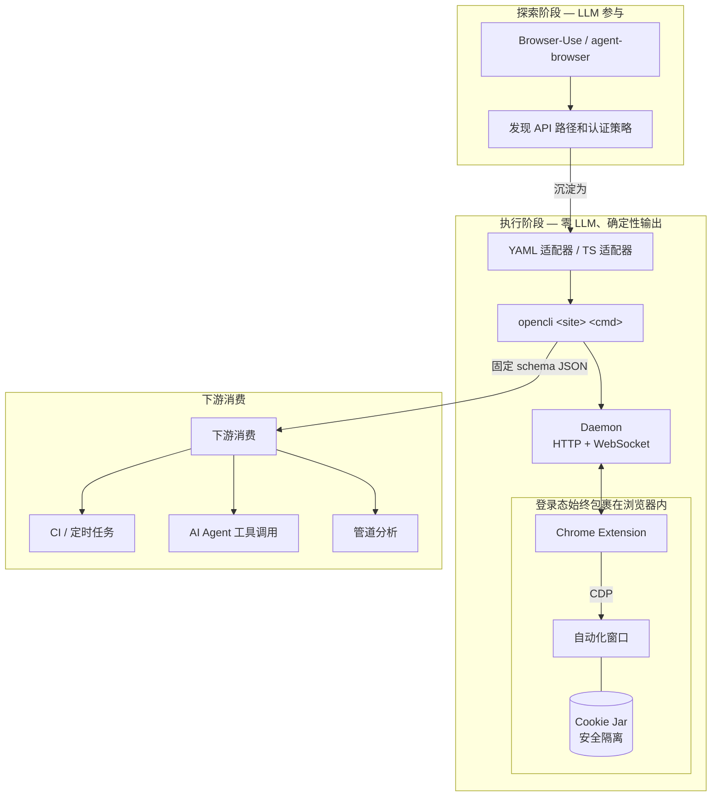

几个月前，我用 Vercel 的 agent-browser 配合 Claude Code Skills，把内网工单分析 SOP 自动化了（[详见这篇文章](https://ata.atatech.org/articles/11020554851)）。给 AI 一段自然语言指令，它就能自动登录内部系统、抓取工单数据、按预设维度输出分析报告。演示效果很惊艳，但真正跑起来之后，问题逐渐显现。

**第一个问题是登录态**。agent-browser 虽然支持 CDP（Chrome DevTools Protocol）连接已有浏览器，但实际操作中很难复用我当前已经登录好的浏览器会话。它要么需要我手动导出 cookie 传进去，要么在 CDP 连接后重新走一遍登录流程——而公司内部系统的 SSO 跳转链相当复杂，每次重新登录都是一场噩梦。

**第二个问题是编排**。工单分析这个场景看似简单，实际要跨好几个独立系统：先去 A 系统查工单列表，再去 B 系统查关联的需求信息，最后可能还要到 C 系统拉取发布记录。这些系统各自有独立的域名和登录态，Skills 里的自然语言指令很难稳定地描述“先去这里查这个，再带着结果去那里查那个”这种跨系统流程。每次执行都像在开盲盒，不知道会卡在哪个跳转环节。

**第三个问题是确定性**。同一条指令跑十次，LLM 可能走出十条不同的操作路径，输出结构也不固定。每次分析都要消耗 token，工单量一多，成本就上去了。DOM 定位始终不够稳定，偶尔会遇到页面改版导致脚本失效的情况。


我最后找到的出路是一个很朴素的观察：绝大多数内网系统都是 SPA，页面数据本质来自接口请求。与其让 AI 学会“怎么点页面”，不如让它直接执行已经被验证过的请求。在 DevTools Network 面板里 Copy as fetch，再用 `agent-browser eval` 执行，拿到 JSON 数据后交给模型分析。

这套方案缓解了 DOM 不稳定的问题，但前面提到的两个根本难题——**登录态复用**和**跨系统编排**——并没有真正解决。它仍然依赖 CDP 连接，无法无缝复用我日常浏览器里的已登录会话；跨系统的数据流转还是靠自然语言描述，缺乏可靠的机制保证。

更重要的是，这套方案有一个底层局限：**每次执行都依赖 LLM，成本降不下来，输出也无法完全复现**。

这让我意识到一件事：数据采集和数据分析，应该是两个独立的环节。前者要的是确定性、零成本和可靠的登录态管理，后者才需要灵活性。带着这个洞察，我遇到了 [OpenCLI](https://github.com/jackwener/opencli)。

## 从探索到沉淀：为什么需要另一种思路

最近半年，Browser-Use、Stagehand、Vercel 的 agent-browser 这类项目接连出圈。它们的核心卖点是让 LLM 直接控制浏览器，在探索性、一次性任务上确实很强。Crawl4AI 在大规模爬取场景也有自己的优势。

但如果你的需求是“用确定的命令、拿到确定的输出、安全地复用已有登录态”，那就需要另一种思路：**不是让 AI 持续参与执行，而是把探索阶段的成果沉淀为可复用的代码**。

这也是我后来用 OpenCLI 解决工时填报问题的出发点。每周五下午，我都要做同一件事：打开请假系统查这周请了几天假，算一下实际工作天数，再切到 Aone 填写工时。流程简单到不值得吐槽，但每周重复一次就变成了一种低级消耗。我试过用 Puppeteer 写脚本自动化，结果在内部系统的 SSO 登录和跳转逻辑上花了比填工时本身更多的时间。直到用 OpenCLI，用一个 YAML 文件和一条命令就把这件事解决了。

<video width="100%" height="560" controls="controls" autoplay="autoplay" src="//cloud.video.taobao.com/vod/q-oHGeDLkw58QbtQfOL5CxEu8K7MMT8H6qpzrWjOMDc.mp4"></video>


这篇文章聊两件事：OpenCLI 这个项目本身的理念和价值，以及我基于它开发工时填报插件的实际体验。

## OpenCLI 的架构思路

OpenCLI 的 slogan 是 “Make any website your CLI”。第一次看到这句话我没太当回事，把网站操作包装成命令行，Puppeteer 时代大家就在做了。但深入看完架构之后，我发现它和传统方案的根本区别在于：**它不是一个爬虫框架，而是一个 CLI Hub**。

#### 先理解问题：传统方案卡在哪

用 Puppeteer 或 Playwright 写自动化脚本时，你通常要处理一整条链路：启动浏览器、绕过反爬、登录、操作页面、解析数据。这些框架只提供底层 API，剩下的都得自己搭。

更麻烦的是**登录态**。如果你要操作的是内部系统（比如公司 OA），每次脚本启动都要重新走一遍 SSO 登录流程，或者手动导出 cookie 传进去。这在实际使用中很脆弱。

#### OpenCLI 的核心洞察

OpenCLI 的设计可以概括为一句话：**登录态留在浏览器里，操作逻辑写在配置里**。

它把“如何连接网站”和“如何操作网站”解耦，让后者可以沉淀为可复用的适配器。你不需要启动新的浏览器实例，也不需要导出 cookie，只要复用你日常使用的 Chrome 即可。

#### 三层架构，各司其职

OpenCLI 把整条链路拆成三层：

**第一层：CLI 入口**

```
opencli <site> <command>
```

这是统一入口。每个命令带一个 `strategy` 字段（`cookie` / `header` / `intercept` / `ui` / `public`），告诉系统"我需要什么样的浏览器上下文"。

**第二层：执行引擎**

收到命令后，引擎做三件事：

- 根据 `strategy` 判断是否需要浏览器会话
- 校验参数、预导航到目标域名、设置超时管控
- 把任务丢给 Pipeline 引擎按步骤顺序执行

**第三层：浏览器桥接**

这一层解决“如何安全地复用你正在用的 Chrome”。

OpenCLI 在本地启动一个轻量 Daemon（默认 `127.0.0.1:19825`），通过 HTTP 和 WebSocket 与你的 Chrome Extension 保持连接。CLI 发请求给 Daemon，Daemon 转发给 Extension，Extension 用 Chrome Debugger API（CDP）在一个**独立的自动化窗口**里执行操作。

关键点：**Cookie 始终待在 Chrome 的 cookie jar 里**，Daemon 和 CLI 都拿不到原始凭证。

```
CLI 命令 → Daemon (HTTP) → Extension (WebSocket) → Chrome CDP → 自动化窗口
                ↑___________________________________________↓
                              返回执行结果
```




#### 这个架构带来什么

**1. 浏览器会话无缝复用**

你不用导出 cookie，也不用重新登录。只要你在 Chrome 里已经登录了某个网站，OpenCLI 就能直接操作。执行前引擎会自动导航到目标域名建立上下文——如果已经在该域名下，这一步直接跳过。

这正好解决了之前 agent-browser 方案的登录痛点。之前要么要手动导出 cookie，要么要在 CDP 里重新走 SSO 流程；现在只要我每天正常用 Chrome 登录过这些内部系统，OpenCLI 就能直接复用这些会话，完全跳过了登录环节。

**2. 确定性输出**

每个命令背后是一个预定义的适配器，返回固定 schema 的 JSON。跑一万次，输出结构永远一致。对 CI 流水线、定时任务和 AI Agent 的工具调用来说，这意味着你不需要再写一层"理解 LLM 输出"的适配逻辑。

**3. 零 LLM 成本**

适配器写好之后，执行就是纯粹的 HTTP 请求或 DOM 操作，没有 token 消耗。

**4. 安全与隔离**

- 操作在独立窗口进行，不影响你正常浏览
- Cookie 不离开浏览器，Daemon 和 CLI 进程都拿不到原始凭证
- Daemon 按需启动，空闲 5 分钟自动退出，不常驻后台

#### 对比：探索 vs 沉淀

| 阶段 | 工具 | 特点 |
|------|------|------|
| 探索 | Browser-Use / agent-browser | LLM 参与，适合一次性任务和原型验证 |
| 沉淀 | OpenCLI 适配器 | 零 LLM 成本，确定性输出，可脚本化 |


OpenCLI 的定位是**沉淀**：把探索清楚的操作逻辑固化为可反复执行的命令。它自身也提供了 `explore` 和 `synthesize` 命令来辅助这个“探索→沉淀”的过程。

OpenCLI 目前内置了 65+ 站点适配器，覆盖国内外主流平台。除了插件机制，它还支持把本地 CLI 工具（`gh`、`docker`、`kubectl`）统一注册进来，甚至能 CLI 化 Electron 桌面应用。AI Agent 只需要跑一句 `opencli list` 就能发现你所有的工具——这是一个优雅的服务发现机制。

## 适配器引擎：YAML 管道的编排能力

OpenCLI 的适配器分 YAML 声明式管道和 TypeScript 编程式两种写法。我更想聊的是 YAML 管道，它的编排能力远比“写个配置文件”要强得多。

先看一个最简单的例子：

```yaml
site: bilibili
name: hot
strategy: cookie
pipeline:
  - navigate: https://www.bilibili.com
  - evaluate: |
      (async () => {
        const res = await fetch('/api/hot', { credentials: 'include' });
        return (await res.json()).data.items;
      })()
  - map:
      title: ${{ item.title }}
      score: ${{ item.score }}
  - limit: ${{ args.limit }}
```

几行 YAML 就定义了“导航 → 调用 API → 映射字段 → 截断输出”这条完整管道。

OpenCLI 的管道引擎内置了 16 种步骤类型，覆盖三个层次：浏览器交互原语（`navigate`、`click`、`type`、`evaluate` 等）、数据获取（`fetch`、`intercept`、`tap`）、数据变换（`select`、`map`、`filter`、`sort`、`limit`）。

两个比较高级的步骤值得单独提。`intercept` 是声明式的 XHR 拦截：你指定一个 URL 匹配模式和触发动作，管道引擎自动注入拦截器、执行触发、等待网络响应、提取数据。`tap` 能直接桥接到页面的 Pinia/Vuex Store，调用 Store Action 并捕获其触发的网络请求——这意味着你不需要逆向 API 参数，直接复用前端框架自身的数据获取逻辑。

把这些步骤串联起来的是管道引擎的状态流转机制。每一步的返回值自动成为下一步的 `data` 上下文，通过 `${{ data | json }}` 这样的模板表达式传递。模板引擎支持管道过滤器、JS 表达式，加上 `args` 上下文可以引用命令行参数，整个管道就变成了一个参数化的、可复用的工作流。

这种编排能力在实际开发中意味着什么？以我的 inventory 插件为例：四个步骤跨两个域、涉及日期推算、动态参数计算、从页面全局变量提取 staffId、最后写入数据——所有这些逻辑都在一个 YAML 文件里用 `navigate` + `evaluate` + 模板变量完成了，没有写一行 TypeScript。

## 实践：开发一个内部工时填报插件

聊完理念，回到开头那个工时填报的痛点。我基于 OpenCLI 的插件机制写了一个 Aone 工时填报管理插件（[opencli-inventory](https://code.alibaba-inc.com/yuankun.yk/opencli-inventory)），用一条命令把查请假、算天数、写入工时这个流程全自动化。

#### 插件结构

OpenCLI 的插件机制很简洁。一个插件就是一个目录，里面放 `.yaml` 或编译好的 `.js` 适配器文件，加上一个 `opencli-plugin.json` 声明文件：

```json
{
  "name": "inventory",
  "version": "0.1.0",
  "description": "Aone 工时填报管理插件",
  "opencli": ">=1.5.4"
}
```

安装方式很直接：`opencli plugin install file:///path/to/inventory`，插件的命令就会自动注册到 `opencli inventory <command>` 命名空间下。

最开始我分别写了 TypeScript 版的 `vacation`（查请假）和 `update`（写工时）两个独立命令。后来发现 YAML 管道的编排能力足以把它们串成一条完整的流程，就收敛到了 `orchestrate` 这一个入口。

#### 核心设计：YAML 管道编排跨域操作

这个插件最有意思的地方在于它需要**跨两个不同域的内部系统操作**：先去 `aliyun-vacation.alibaba-inc.com` 查请假记录，再去 `team.aone.alibaba-inc.com` 写入工时。两个域有各自独立的 cookie 会话。

这正是之前 Skills 方案难以优雅解决的问题。当时跨系统的数据流转要靠自然语言指令描述，“先去 A 系统查这个，再带着结果去 B 系统查那个”这种逻辑，AI 每次执行都可能理解偏差。而 OpenCLI 的 YAML 管道把编排显性化了：每一步的输入输出通过 `data` 上下文传递，跨域导航通过独立的 `navigate` 步骤完成，整个流程是确定的、可预期的。

我用 YAML 管道把整个流程编排成四个步骤：

第一步，导航到请假系统，复用浏览器的 cookie 会话，调用请假记录查询接口。这里有一段日期推算逻辑：如果用户没传 `startDate`，自动取本周一到今天的区间。

第二步，根据请假天数计算调整后的工时。每请假一天减少 10 个 personDay（基准 50 对应 5 个工作日）。

第三步，导航到 Aone 域。这一步既是为了建立 Aone 的 cookie 会话，也是为了从页面的 `window.AK_GLOBAL.keludeUser.staffId` 自动提取员工 ID——用户不需要手动输入自己的工号。

第四步，调用 Aone 的更新接口写入计算好的工时数据。

最终用户只需要跑一条命令：

```bash
opencli inventory orchestrate --targetId 2035412
```

`startDate` 可以省略（自动取本周一），`staffId` 从页面自动提取，请假天数自动查询和扣减。整个过程十几秒内完成，替代了之前每周手动操作两个系统、来回切换页面的繁琐流程。

#### 开发感受

YAML 管道的表达力超出预期。我原本以为跨域操作、动态参数计算这种需求必须用 TypeScript 去写，结果 YAML 管道的 `navigate` + `evaluate` + 模板变量组合起来完全够用。管道步骤之间通过 `data` 上下文自动传递状态，不需要手动管理中间变量。

写的时候确实流畅，但一旦出错，定位问题就没那么轻松了——YAML 里嵌入大段 JavaScript 时，报错信息有时不够精确，需要加 `-v` 看 pipeline debug 输出来排查。另外跨域导航的 cookie 建立依赖 `navigate` + `wait` 的组合，偶尔会遇到页面加载时序的问题，需要手动加 `wait` 步骤兜底。

浏览器会话复用真的省心。两个内部系统都有复杂的 SSO 登录流程，如果要用 Puppeteer 模拟登录，光处理跳转和验证码就够头疼的。OpenCLI 直接复用 Chrome 里已有的登录态，这一整块问题消失了。

插件机制足够轻量。从零到第一个可用命令大概花了不到两个小时。`opencli-plugin.json` 声明 → 写 YAML pipeline → `opencli plugin install file://...` 安装 → 直接测试，没有复杂的脚手架或配置仪式。

## Skills vs OpenCLI：两种沉淀方式的对比


回过头看，内网工单自动化和工时填报这两个案例，本质上是在解决同一类问题的不同阶段。

**Skills 是“自然语言 SOP”**。它的载体是 Markdown，AI 每次执行时都要重新“阅读理解”这份 SOP，然后决定怎么操作。这带来了极强的灵活性，不同角色只需要改几行提示词就能得到不同切面的分析结果。但代价是每次执行都消耗 token，而且 AI 对同一份 SOP 的理解可能存在偏差，输出不完全可复现。

**OpenCLI 适配器是“代码化 SOP”**。YAML 管道或 TypeScript 适配器一旦写好，执行路径就是确定的，不需要 AI 参与，零 token 消耗，同一条命令永远返回同一结构的数据。但它也因此失去了 Skills 那种“改一行提示词就换一个分析视角”的灵活性，适配器只负责拿数据，分析是下游的事。

这里需要澄清一个可能的疑问：我之前用 agent-browser 的时候也试过“Copy as fetch + eval”直接调 API，那和 OpenCLI 的 `evaluate` 步骤有什么区别？

关键区别在于**会话管理和编排能力**。手动写 fetch 脚本时，你需要自己处理 cookie 同步、跨域登录态维护、多个请求之间的数据传递。OpenCLI 把这些都框架化了：navigate 自动建立和复用浏览器会话，evaluate 在已登录的上下文中执行，map/filter 等步骤处理数据变换，整个 pipeline 串起来就是一个可复用的适配器。你不需要写脚本管理 Chrome 实例，也不需要自己处理跨域 cookie 的复杂性。

这两种方式并不矛盾，甚至可以组合：用 OpenCLI 做确定性的数据采集（零成本、可脚本化、CI 友好），拿到结构化数据后交给 Skills 或者其他 LLM 工作流做灵活的分析。数据采集和数据分析，前者要的是稳定，后者要的是灵活，用不同的工具去解决各自擅长的部分。

## OpenCLI 在 AI Agent 生态里的位置

更宏观地看，OpenCLI 和 Browser-Use 这类工具解决的是不同层次的问题。

Browser-Use / Stagehand 擅长的是**探索**——你给它一个从没见过的网站，它能靠 LLM 的理解能力去摸索页面结构、找到操作路径。这种能力在一次性任务和原型验证阶段非常有价值。

OpenCLI 擅长的是**沉淀**。一旦操作逻辑被探索清楚并写成适配器，后续的执行就是确定性的、零成本的、可脚本化的。它更像是 AI Agent 的“工具箱”，而不是“探索器”。

我自己的经历也印证了这条路径：先用 agent-browser 探索出内网系统的接口调用方式，再用 OpenCLI 把它固化为可反复执行的适配器。探索阶段的 LLM 消耗是一次性的，沉淀之后的执行是零成本的。OpenCLI 自身也提供了 `explore` 和 `synthesize` 命令来辅助这个“探索→沉淀”的过程。

另一个值得关注的方向是 OpenCLI 对 Electron 应用的 CLI 化支持。通过 CDP + AppleScript，它可以操作 Cursor、Notion、ChatGPT 桌面版这些应用。这意味着 AI Agent 不仅能操作网站，还能操作桌面软件。

## 几点期望

作为使用者，我也想提几点观察。

插件生态还比较早期，官方和社区加起来只有几个插件。考虑到 YAML 管道的低门槛特性，如果有一个插件市场或者索引页来方便发现和分享，生态增长应该会快很多。

YAML 管道的调试体验有提升空间。如果能支持管道步骤的单步执行或断点调试（比如 `opencli run --step 2`），开发效率会更高。

文档方面，SKILL.md 和 CLI-EXPLORER.md 写得很详细，但主要面向 AI Agent 阅读。对人类开发者来说，一份带有完整示例的插件开发 tutorial 会更友好。

## 最后

现在我每周五下午的操作变成了打开终端，跑一条 `opencli inventory orchestrate --targetId 2035412`，然后去倒杯咖啡。这件事本身不值得炫耀，但它让我理解了 OpenCLI 的设计为什么是这样——浏览器会话复用解决了内部系统 SSO 登录的大难题，YAML 管道让非框架作者也能快速写出生产级的自动化流程，CLI Hub 的思路让工具发现和 AI Agent 集成变得自然。

这些价值藏在工程细节里，要真正用起来之后才能体会到。

项目地址：<https://github.com/jackwener/opencli>

我的插件：<https://code.alibaba-inc.com/yuankun.yk/opencli-inventory>
